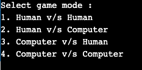
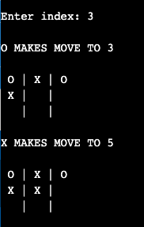
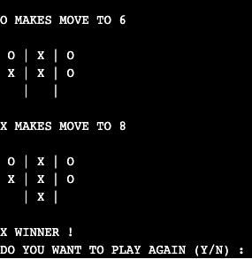

# Unbeatable-TicTacToe
Unbeatable Tic Tac Toe

Language : C++

Concepts Used:
1 Inheritance  
2 Virtual Functions  
3 Runtime polymprophism  
4 Object Oriented Programming  
5 MiniMax Algorithm for decision making 
 

Tic-tac-toe (also known as noughts and crosses or Xs and Os) is a paper-and-pencil game for two players, X and O, who take turns marking the spaces in a 3×3 grid. The player who succeeds in placing three of their marks in a horizontal, vertical, or diagonal row wins the game.

Minimax is a recursive algorithm which is used to choose an optimal move for a player assuming that the opponent is also playing optimally. As its name suggests, its goal is to minimize the maximum loss (minimize the worst case scenario).

Diagram explaining MiniMax algorithm

Final Result : 

